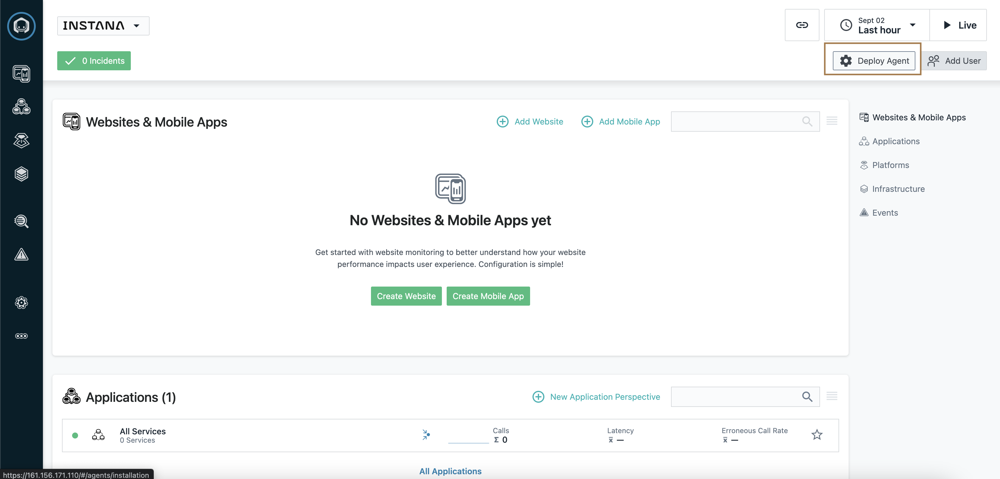
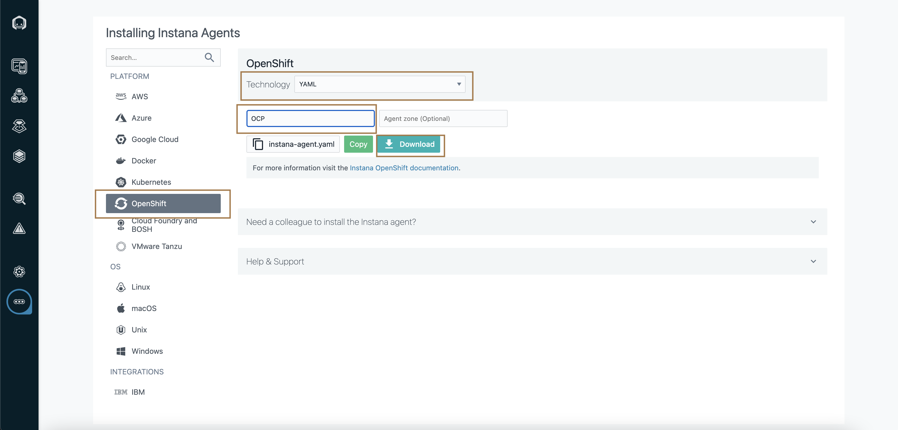

# Intro to Instana Observability for Event Streams (Kafka) Messaging

This is a brief introduction to how you can observe your Event Streams Deployment along with applications in a simulated "Day 2" operations mode.

In this exercise, you will see how Instana can monitor: OCP, Kafka Brokers, Zookeeper, Kafka Connect and custom deployed applications.

In order to proceed with the demo, an Instana instance and OCP cluster are required.

If you want to deploy an Instana VM server, you can use [this Techzone guide](https://techzone.ibm.com/collection/instana-selfdeployon-vsi).

## Demonstration by Instana Tech Sellers
<!---
Edited
-->

After you install an Instana environment, you need to deploy an Instana agent on yout OCP cluster. To install the agent on your OCP cluster, you can automatically generate the list of resourcers from your Instana insance:

* Access the Instana console with the provided credential and click on the top-right button "Deploy Agent"

{: style="width:100%"}
        
{: style="width:100%"}
* Select OpenShift, Technology YAML
* Insert a name for your OCP cluster
* Download the yaml to be applied
* Connect with OC CLI to your OCP cluster where the agent will be installed

`$ oc login --token=<token> --server=<url>`

* Apply the downloaded instana-agent.yaml

`$ oc apply -f instana-agent.yaml`

The agent will create an OCP project (instana-agent) and will deploy a set of resources 

If you connect to your Instana console, after a couple of minutes, you will start receive info from your OCP cluster.

## Access the Instana Instance connected to the Event Streams Cluster

1. Go directly to [Instana Home Page](https://training-kafka.instana.io/)   

1. Login using user id: trainerintegration@gmail.com and the password given to you by the instructors.   Note: all attendees will use the same login credentials.  After you login you should see something like the following.

    

1. Optional - If this is the first time to the site you might have to dismiss the message in the top right corner by single clicking on it.

    

1. Explore the left navigation bar by hovering your mouse over the black bar on the left side.  You should see something like the following.

    

## Base Infrastructure Observability

### OCP Worker Nodes - Cluster Map

1. Go directly to [Infrastructure for OCP Worker Nodes](https://training-kafka.instana.io/#/physical?timeline.ws=300000&timeline.to=1654895400000&timeline.fm=1654895400000&timeline.ar=false&deployment.page=1&snapshotId=QllSytQa5I513X22IH_cZ51nTDo) you should see something like the following.

    

1. Click the down arrow next to "Hosts (6)" in the white box in the upper left corner to see all 6 worker nodes.

    

1. Click one of the worker nodes and you should see something like the following.  Note: you can scroll and open accordians.

    

1. Click "Open Dashboard" button and you should see something like the following.

    

### OCP Worker Nodes - Cluster k8s Dashboard

1. Go directly to [Infrastructure for OCP Worker Nodes](https://training-kafka.instana.io/#/kubernetes/cluster;clusterId=Q8VhkXFGtFTkz0Wj0ACUwXfbNzw/summary?timeline.ws=300000&timeline.to=1654895400000&timeline.fm=1654895400000&timeline.ar=false&deployment.page=1) you should see something like the following.  Note the master and worker nodes are shown along with all the namespaces and the deployments.

    

### All Kubernetes Services for the Event Streams Cluster

1. Go directly to [Kubernetes Cluster Services for cp4i-eventstreams OCP cluster](https://training-kafka.instana.io/#/kubernetes/namespace;namespaceId=8_1DhmCiu43T_1DQWKwUUAxiObg/services?timeline.ws=300000&timeline.to=1654895400000&timeline.fm=1654895400000&timeline.ar=false&deployment.page=1) you should see something like the following.

    

### Kafka Brokers 

1. Go directly to [Kubernetes Cluster Services for es-demo-kafka-brokers Kafka Brokers](https://training-kafka.instana.io/#/kubernetes/service;serviceId=b3b5HqyUadR4BemJgV4Pt6uYKdk/summary?timeline.ws=300000&timeline.to=1654895400000&timeline.fm=1654895400000&timeline.ar=false&deployment.page=1) you should see something like the following.

    

    And Scroll down to see the following.

    

### Zookeeper Services

1. Go directly to [Kubernetes Cluster Services for Zookeeper](https://training-kafka.instana.io/#/kubernetes/service;serviceId=RKawrvO0SzoJarUt6wD4BSJNJ9g/summary?timeline.ws=300000&timeline.to=1654895400000&timeline.fm=1654895400000&timeline.ar=false&deployment.page=1) you should see something like the following.

    

    And Scroll down to see the following.

    

#### Application and Message Dependencies

1. Go directly to [Application Dependencies for the Messages](https://training-kafka.instana.io/#/application;appId=wCa4qi2XSg-oAEB4c9S-zQ/map?timeline.ws=60000&timeline.to=1654895400000&timeline.fm=1654895400000&timeline.ar=false&deployment.page=1&snapshotId=ykF2ZP-cO4WvpdS8FlJXHYsDW38) you should see something like the following.

    

## Application Message Flow and End to End Observability

Instana is the **ONLY** tool that provides full end to end Kafka Message Observability.

### All Services with Dependencies - Unfiltered 

1. Go directly to [Map of All Services with Dependencies - Unfiltered](https://training-kafka.instana.io/#/application;appId=-McjQT-9QiGYFBp41mOkZA/map?timeline.ws=300000&timeline.to=1654895400000&timeline.fm=1654895400000&timeline.ar=false&deployment.page=1) you should see something like the following.

    

### Message-based Dependencies - Filtered

1. Go directly to [Map of Message-based Dependencies - Filtered](https://training-kafka.instana.io/#/application;appId=wCa4qi2XSg-oAEB4c9S-zQ/map?timeline.ws=300000&timeline.to=1654895400000&timeline.fm=1654895400000&timeline.ar=false&deployment.page=1) you should see something like the following.

    

1. The instructors can demonstrate more capabilities for end to end messages.

## Failure & Root Cause Analyis

### Simulate Failure

1. This will be a future exercise and/or demo.

### Drill down to Root Cause

1. This will be a future exercise and/or demo.

## Optional/Takeaway - Explore Instana functionality using the Instana Cloud Sandbox

1. Go directly to [Instana Cloud Sandbox Instance](https://www.instana.com/apm-observability-sandbox/) and login using your IBM email address.

1. After you login using your IBM email addess you should see something like the following.

    

1. Click on the "Get Started" button at the bottom left hand corner.  Follow each of the 5 tutorials to get a feel for Instana.

    
